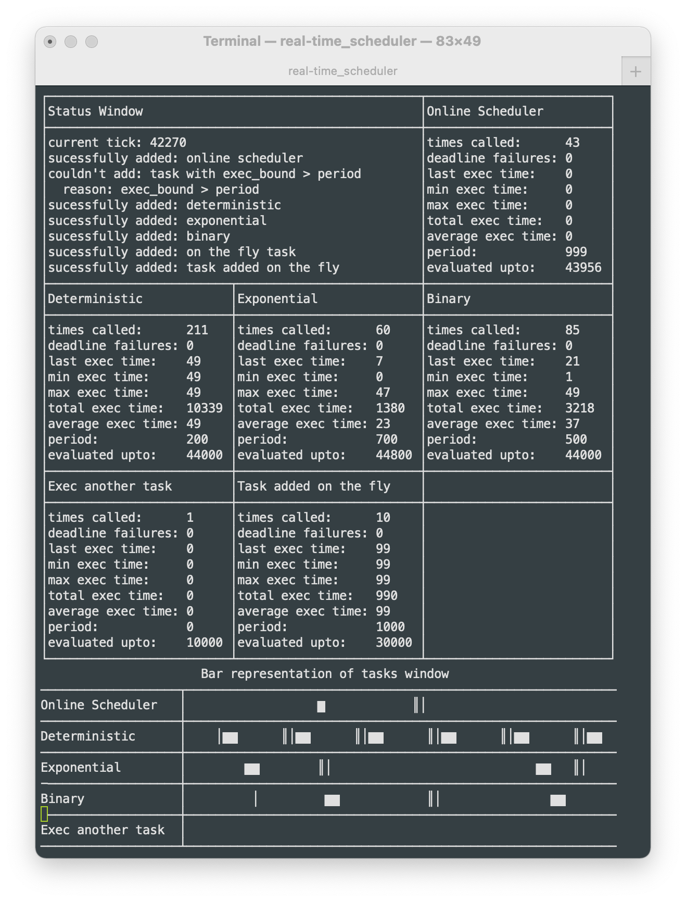

# Real-time Scheduler
### Small RTOS for MCUs

Copyright (c) 2022, John Ryland
All rights reserved.

## Status

## Introduction

This is a very light and simple implementation of a scheduler
using the earliest deadline algorithm.

The schedule is created up to some near event horizon until the
scheduler is able to schedule itself to run again to fill out the
schedule again.

The schedule is executed using a regular hardware timer which updates a tick
and determines the next task to run.

There is some visualization of the schedule as it runs and this is
currently just working on macOS and linux (although it has been made
to work on other platforms previously).

See the screenshot of what it should look like while running:

The main task in porting this to other platforms is providing the
code for receiving timer events, such as installing an interrupt
service routine for a hardware timer, or as is the case with the
macOS version, to interface to some existing OS API.

The plan is to get this working on the Pi Pico as a target platform.

